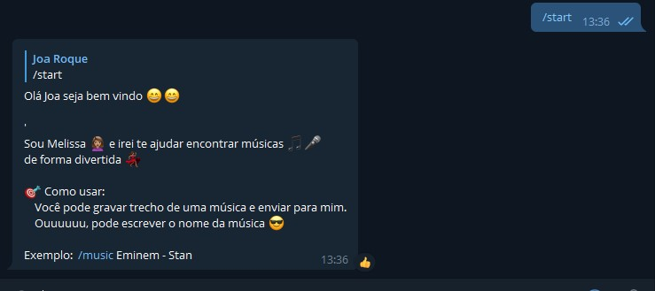
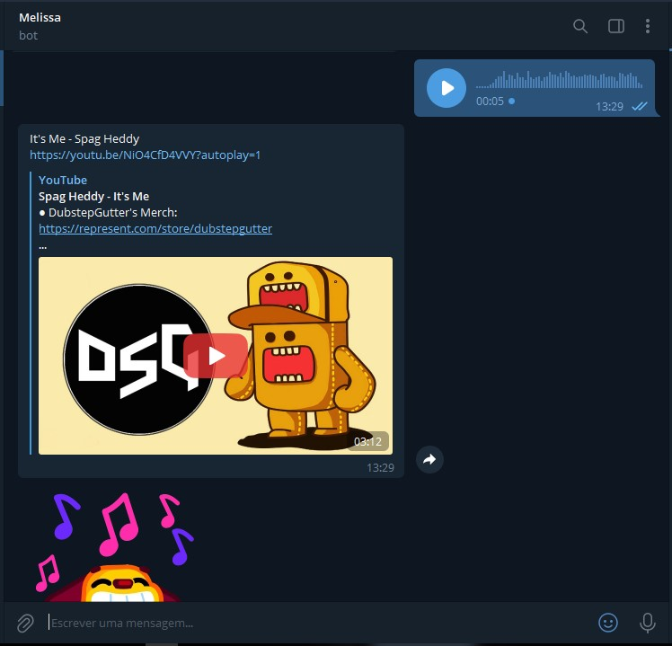
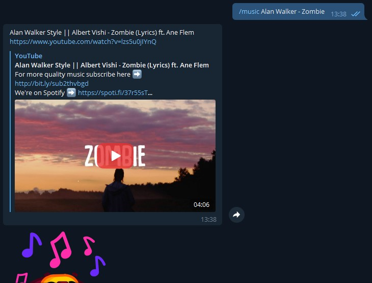

<p align="center">
  <a href="t.me/MelissaSongs_bot">
    
  </a>
</p>
<h2 align="center">Find songs on Telegram, like on Shazam... 😎</h2>
<p align="center">
    <a href="https://t.me/MelissaSongs_bot" target="blank">Open on telegram</a>
    ·
    <a href="https://github.com/saviomartin/slickr/issues">Report Bug</a>
    ·
    <a href="https://github.com/saviomartin/slickr/issues">Request Feature</a>
</p>
<p align="center">
<a href="https://github.com/joaroque/MelissaSongs/blob/main/LICENSE" target="blank">

</a>
<a href="https://github.com/joaroque/MelissaSongs/fork" target="blank">

</a>
<a href="https://github.com/joaroque/MelissaSongs/stargazers" target="blank">

</a>
<a href="https://github.com/joaroque/MelissaSongs/issues" target="blank">

</a>
<a href="https://github.com/joaroque/MelissaSongs/pulls" target="blank">

</a>
</p>

## :arrow_down: Installation
To get a local copy installed and working, follow these steps:

 - Clone this repository

    ```console
    git clone https://github.com/joaroque/MelissaSongs.git
    ```
    
 - Enter the project folder

    ```sh
    cd melissaSongs
    ```

### 📦 Install dependencies

Note: use `pip install -r requirements .txt` to install all dependencies.

- Install pyTelegramBotAPI framework

        pip install pyTelegramBotAPI

 - Install youtube-dl

        pip install youtube-dl

 - Install youtube-search-python
 
        pip install youtube-search-python
        
 - Install shazamIO

        pip install shazamio


### 🚀 Setup the bot

> The bot messages are in Portuguese, I have not yet implemented an i18n middleware to handle the translations, but if you want to change it, access the `/utils/messages.py` file.

 1. Get the token from <a href="https://t.me/BotFather">@BotFather</a>

 2. Insert your token in the `.env` file

    ```py
    TOKEN = "INSERT_YOUR_TOKEN_HERE"
    VOICE_DIR=tg_voices/
    AUDIO_DIR=tg_audios/
    ```

 4. Start the bot

    ```shell
    python bot.py
    ```
   


## 🟪 Deploy on Heroku

[Deploy](https://www.herokucdn.com/deploy/button.svg)


## 📷 Screenshots

1. The `\start` command


2. Search songs with music snippets like in Shazam


3. Search songs with title. eg: `\music` Alan Walker -Zombie



## Meta

I made this banner using saviomartin's [Slickr](https://slickr.vercel.app/) tool.
